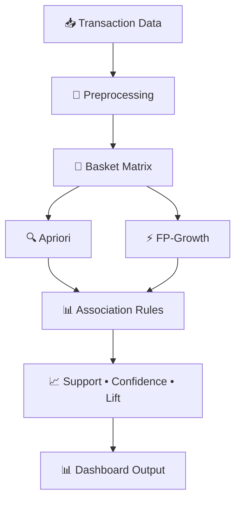

<div align="center">

# 🛒 Supermarket Market Basket Analysis


**A Flask-based web application that uncovers hidden customer purchasing patterns using association rule mining.**

[✨ Features](#-features) • [⚙️ Installation](#️-installation--setup) • [📊 How It Works](#-how-it-works) • [🧠 Tech Stack](#-tech-stack) • [📂 Project Structure](#-project-structure)

</div>

---

## ✨ Features

| Feature | Description |
|--------|------------|
| 📦 **Frequent Products** | Identify top-selling products across transactions |
| 🔗 **Association Rules** | Generate rules using **Apriori** & **FP-Growth** |
| 📊 **Interactive Charts** | Visualize patterns with Chart.js dashboards |
| ⚡ **Performance Benchmark** | Compare execution time of both algorithms |
| 💡 **Bundle Recommendations** | Smart cross-selling suggestions using lift |
| 🎨 **Modern UI** | Responsive dashboard with animations & icons |

---

## 🧠 Tech Stack

### 🔙 Backend
- 🐍 Python 3.8+
- 🌐 Flask
- 📊 Pandas & NumPy
- 🤖 MLxtend (Apriori & FP-Growth)

### 🎨 Frontend
- HTML5, CSS3, JavaScript
- 📉 Chart.js (interactive visualizations)

---

## 📂 Project Structure

```bash
Supermarket-Market-Basket/
│
├── data/
│   └── raw/
│       ├── order_products__prior.csv   
│       └── products.csv               
│
├── models/
│   ├── preprocessing.py               
│   ├── apriori_model.py               
│   └── fpgrowth_model.py              
│
├── templates/
│   ├── index.html                     
│   └── results.html                   
│
├── static/
│   └── css/
│       └── style.css                  
│
├── Screenshots/
│   ├── Image1.png
│   ├── Apriori.png  
│   └── FPgrowth.png
│
├── app.py                             
└── requirements.txt

```

## ⚙️ Installation & Setup

### Prerequisites
- Python 3.8 or higher
- pip package manager

### 1️⃣ Clone the Repository
```bash
git clone https://github.com/BhagyashreeMohalkar/Supermarket-Market-Basket.git
cd Supermarket-Market-Basket
```

### 2️⃣ Create a Virtual Environment
```bash
python -m venv venv
```

### 3️⃣ Activate the Environment

**Windows:**
```bash
venv\Scripts\activate
```

**macOS / Linux:**
```bash
source venv/bin/activate
```

### 4️⃣ Install Dependencies
```bash
pip install -r requirements.txt
```

---

## ▶️ Run the Application
```bash
python app.py
```

Open your browser and navigate to: http://127.0.0.1:5000

-```markdown
## 📊 How It Works


---

## 📈 Output & Metrics

| Output | Description |
|---|---|
| 🏆 Top Frequent Products | Products with highest transaction frequency |
| 🔗 Association Rules | Rules ranked by support, confidence & lift |
| 💡 Product Bundles | Recommended item combinations for cross-selling |
| ⏱️ Execution Time | Side-by-side runtime comparison of both algorithms |
| 📉 Interactive Charts | Bar charts and performance graphs |

**Key Metrics Explained:**

| Metric | Formula | Meaning |
|---|---|---|
| **Support** | freq(A∪B) / N | How often items appear together |
| **Confidence** | freq(A∪B) / freq(A) | How often the rule is correct |
| **Lift** | Confidence / Support(B) | Strength vs. random chance (>1 is meaningful) |

---

## 📸 Screenshots

<p align="center">
  
</p>

<p align="center">
  
</p>

<p align="center">
  
</p>

---
## 📦 Dataset

This project uses the [Instacart Online Grocery Dataset](https://www.kaggle.com/c/instacart-market-basket-analysis/data).

Place your data files here:
data/raw/

## 📄 License

This project is licensed under the [MIT License](LICENSE).

---

<div align="center">

Made with ❤️ using Python & Flask

⭐ **Star this repo if you found it useful!** ⭐

</div>
